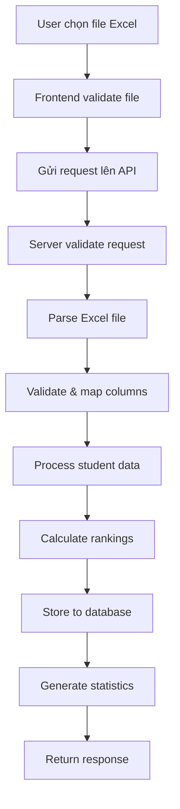

# 📋 QUY TRÌNH UPLOAD FILE EXCEL - WORKFLOW DOCUMENTATION

## 📖 Tổng quan

Tài liệu này mô tả chi tiết các bước và công việc cần thực hiện khi upload file Excel chứa kết quả thi BAC hoặc BREVET lên hệ thống.

---

## 🔄 **WORKFLOW TỔNG QUÁT**



---

## 📝 **CHI TIẾT CÁC CÔNG VIỆC**

### **PHASE 1: VALIDATION & SETUP** ⚡

#### ✅ **1.1. Validate Request**

```typescript
// Công việc cần làm:
- Kiểm tra Content-Type: multipart/form-data
- Validate file size: <= 4.5MB (Vercel limit)
- Check database connection
- Parse form data với timeout 30s
```

#### ✅ **1.2. Validate File**

```typescript
// Công việc cần làm:
- Check file exists và không empty
- Validate file extension: .xlsx, .xls
- Validate MIME type
- Check file instance type
```

#### ✅ **1.3. Validate Parameters**

```typescript
// Công việc cần làm:
- year: 2020-2030 range
- examType: "BAC" hoặc "BREVET"
- columnMapping: Parse JSON nếu có
```

---

### **PHASE 2: EXCEL PROCESSING** 📊

#### ✅ **2.1. Load Excel File**

```typescript
// Công việc cần làm:
- Convert file to ArrayBuffer với timeout 20s
- Parse workbook với XLSX library
- Get first worksheet
- Convert to JSON array
```

#### ✅ **2.2. Column Mapping**

```typescript
// Công việc cần làm:
- Sử dụng provided mapping HOẶC auto-detect
- Map theo exam type (BAC/BREVET)
- Validate required columns tồn tại
- Log mapping results
```

**BAC Required Columns:**

- `matricule`: NODOSS, Num_Bac
- `nom_complet`: NOMPL, Nom_FR
- `section`: SERIE
- `moyenne`: MOYBAC, Moy_Bac
- `ecole`: Libnoetce, Centre Examen FR
- `etablissement`: Libnoets, Etablissement_FR
- `decision`: Decision

**BREVET Required Columns:**

- `matricule`: Num_Bepc
- `nom_complet`: NOM
- `moyenne`: Moyenne_Bepc
- `ecole`: Ecole
- `etablissement`: Centre
- `decision`: Decision

---

### **PHASE 3: DATA PROCESSING** 🔄

#### ✅ **3.1. Process Student Records**

```typescript
// Công việc cần làm (cho mỗi row):
- Extract data theo column mapping
- Validate matricule & nom_complet không empty
- Parse và validate moyenne
- Determine admis status từ decision
- Handle délibérable cases đặc biệt
- Add optional fields (lieu_nais, date_naiss)
- Skip invalid rows với warning log
```

#### ✅ **3.2. Moyenne Calculation Logic**

```typescript
// Steps:
1. Initialize moyenne = 0
2. Get moyenneField từ Excel
3. Validate not null/undefined/empty
4. Normalize format: replace "," với "."
5. Parse với Number.parseFloat()
6. Handle NaN → set to 0
7. Override với 10.0 nếu délibérable
```

#### ✅ **3.3. Admis Status Logic**

```typescript
// Steps:
1. Get decision text từ Excel
2. Convert to lowercase
3. Check keywords: "admis", "reussi", "r"
4. Handle délibérable special case:
   - Set isAdmitted = true
   - Change decisionText = "ADMIS"
   - Override moyenne = 10.0
```

---

### **PHASE 4: RANKING CALCULATION** 📈

#### ✅ **4.1. Section Ranking**

```typescript
// Công việc cần làm:
- Group students by section
- Sort by moyenne DESC trong mỗi section
- Assign rang (1, 2, 3, ...)
- Update student.rang field
```

#### ✅ **4.2. Establishment Ranking**

```typescript
// Công việc cần làm:
- Group students by etablissement
- Sort by moyenne DESC trong mỗi establishment
- Assign rang_etablissement (1, 2, 3, ...)
- Update student.rang_etablissement field
```

---

### **PHASE 5: DATABASE OPERATIONS** 💾

#### ✅ **5.1. Database Setup**

```typescript
// Công việc cần làm:
- Get PostgreSQL connection từ pool
- Start transaction (BEGIN)
- Create tables nếu chưa có
- Clear existing data cho year + examType
```

#### ✅ **5.2. Batch Insert**

```typescript
// Công việc cần làm:
- Process students theo batches (100 records/batch)
- Build INSERT query với VALUES placeholders
- Map student fields to database columns
- Execute batch insert
- Log progress mỗi 2000 records
```

#### ✅ **5.3. Transaction Handling**

```typescript
// Công việc cần làm:
- COMMIT nếu tất cả thành công
- ROLLBACK nếu có error
- Release database connection
- Log results
```

---

### **PHASE 6: RESPONSE GENERATION** 📊

#### ✅ **6.1. Generate Statistics**

```typescript
// Công việc cần làm:
- totalStudents: count all
- admittedStudents: count where admis = true
- admissionRate: percentage calculation
- sections: unique list
- schools: unique list
- establishments: unique list
- wilayas: unique list
- averageScore: overall moyenne
```

#### ✅ **6.2. Build Response**

```typescript
// Response structure:
{
  message: "Success message với count",
  stats: { /* statistics object */ },
  fileInfo: {
    name: "filename.xlsx",
    size: 1234567,
    type: "application/..."
  },
  dbInfo: {
    stored: true,
    year: 2025,
    examType: "BAC"
  }
}
```

---

## ⚠️ **ERROR HANDLING CHECKLIST**

### **File Errors:**

- [ ] File too large (>4.5MB)
- [ ] Invalid file format
- [ ] Corrupted Excel file
- [ ] Empty file
- [ ] Parsing timeout

### **Data Errors:**

- [ ] Missing required columns
- [ ] Invalid year range
- [ ] Invalid exam type
- [ ] Empty worksheet
- [ ] No valid student records

### **Database Errors:**

- [ ] Connection failure
- [ ] Transaction rollback
- [ ] Constraint violations
- [ ] Storage timeout

### **System Errors:**

- [ ] Memory overflow
- [ ] Request timeout (60s limit)
- [ ] Parsing timeout (30s limit)
- [ ] Out of memory errors

---

## 🔧 **PERFORMANCE OPTIMIZATIONS**

### **Memory Management:**

- [ ] Process students theo batches (500 records)
- [ ] Release Excel data sau parse
- [ ] Use streaming cho large files
- [ ] Connection pooling

### **Timeout Management:**

- [ ] Form parsing: 30s timeout
- [ ] File reading: 20s timeout
- [ ] Overall request: 60s timeout
- [ ] Progress logging mỗi batch

### **Database Optimization:**

- [ ] Batch inserts (100 records)
- [ ] Proper indexes
- [ ] Transaction management
- [ ] Connection pooling

---

## 📋 **VALIDATION CHECKLIST**

### **Pre-Upload:**

- [ ] File được chọn
- [ ] File size < 4.5MB
- [ ] File extension hợp lệ (.xlsx, .xls)
- [ ] Year trong range 2020-2030
- [ ] ExamType là BAC hoặc BREVET

### **During Processing:**

- [ ] Excel parse thành công
- [ ] Required columns tồn tại
- [ ] Có ít nhất 1 valid student record
- [ ] Database connection OK
- [ ] No timeout errors

### **Post-Processing:**

- [ ] All students có ranking
- [ ] Statistics được generate
- [ ] Data stored successfully
- [ ] Response complete

---

## 🎯 **SUCCESS CRITERIA**

### **Functional Requirements:**

✅ File upload thành công  
✅ Data parsing chính xác  
✅ Rankings được tính đúng  
✅ Database lưu trữ complete  
✅ Statistics chính xác

### **Non-Functional Requirements:**

✅ Response time < 60s  
✅ Memory usage controlled  
✅ Error handling robust  
✅ Transaction safety  
✅ Data integrity maintained

---

## 📊 **MONITORING & LOGGING**

### **Key Metrics:**

- Upload success rate
- Processing time per file
- Average records per minute
- Memory usage peaks
- Database connection utilization

### **Log Points:**

- [ ] File validation results
- [ ] Column mapping success/failure
- [ ] Student processing progress
- [ ] Database operation results
- [ ] Error details với stack trace

---

## 🔄 **ROLLBACK PROCEDURES**

### **Database Rollback:**

1. Transaction ROLLBACK automatic
2. Previous data preserved
3. Error logged với details
4. User notified của failure

### **Partial Success Handling:**

1. All-or-nothing approach
2. No partial data commits
3. Clear error messages
4. Retry recommendations

---

## 📖 **RELATED DOCUMENTATION**

- `MOYENNE_LOGIC_ANALYSIS.md` - Chi tiết logic tính moyenne
- `ADMIS_LOGIC_ANALYSIS.md` - Chi tiết logic xác định admis
- `API_DOCUMENTATION.md` - API specifications
- `STORAGE_SYSTEMS.md` - Database schema details

---

## 🚀 **QUICK REFERENCE**

### **Key Timeouts:**

- Form parsing: 30s
- File reading: 20s
- Total request: 60s

### **Key Limits:**

- File size: 4.5MB
- Batch size: 100 records
- Progress log: every 2000 records

### **Key Paths:**

- Upload API: `/api/admin/upload`
- Analyze API: `/api/admin/analyze-excel`
- Database: PostgreSQL với connection pool
