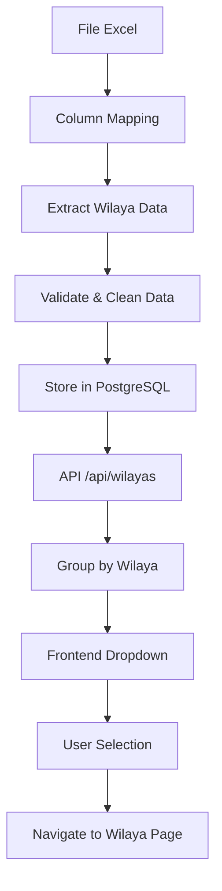

# Xử lý dữ liệu Wilaya khi Import Excel

## Tổng quan

Tài liệu này mô tả chi tiết cách hệ thống xử lý và lấy dữ liệu wilaya từ file Excel khi import dữ liệu học sinh.

## 1. Cấu trúc File Excel

### 1.1 Đối với BAC

```
Cột wilaya có thể có tên:
- WILAYA_FR
- Wilaya_FR
(Hệ thống sẽ tự động nhận diện cả 2 format này)
```

### 1.2 Đối với BREVET

```
Cột wilaya có tên:
- WILAYA
```

### 1.3 Ví dụ cấu trúc Excel cho BAC:

```
| NODOSS | NOMPL        | SERIE | Libnoets           | WILAYA_FR | MOYBAC | Decision |
|--------|--------------|-------|-------------------|-----------|---------|----------|
| 123456 | Ahmed Ali    | SN    | Lycée Nouakchott  | Nouakchott| 15.25   | ADMIS    |
| 123457 | Fatima Omar  | M     | Lycée Rosso       | Trarza    | 14.80   | ADMIS    |
```

### 1.4 Ví dụ cấu trúc Excel cho BREVET:

```
| Num_Bepc | NOM          | Ecole              | Centre            | WILAYA     | Moyenne_Bepc | Decision |
|----------|--------------|-------------------|-------------------|------------|--------------|----------|
| 789123   | Mohamed Said | Ecole Nouakchott  | Centre Tevragh    | Nouakchott | 12.50        | ADMIS    |
| 789124   | Aicha Mint   | Ecole Rosso       | Centre Rosso      | Trarza     | 13.20        | ADMIS    |
```

## 2. Column Mapping trong Code

### 2.1 File: `app/api/admin/upload/route.ts`

```typescript
// Column mapping cho BAC
if (examType === "BAC") {
  columnMappingOptions = {
    matricule: ["NODOSS", "Num_Bac"],
    nom_complet: ["NOMPL", "Nom_FR"],
    section: ["SERIE"],
    ecole: ["Libnoetce", "Centre Examen  FR", "Centre Examen FR"],
    etablissement: ["Libnoets", "Etablissement_FR"],
    moyenne: ["MOYBAC", "Moy_Bac"],
    decision: ["Decision"],
    wilaya: ["WILAYA_FR", "Wilaya_FR"], // ← Wilaya mapping cho BAC
    lieu_nais: ["Lieun_FR"],
    date_naiss: ["Date Naiss"],
  };
}

// Column mapping cho BREVET
if (examType === "BREVET") {
  columnMappingOptions = {
    matricule: ["Num_Bepc"],
    nom_complet: ["NOM"],
    wilaya: ["WILAYA"], // ← Wilaya mapping cho BREVET
    ecole: ["Ecole"],
    etablissement: ["Centre"],
    moyenne: ["Moyenne_Bepc"],
    decision: ["Decision"],
    lieu_nais: ["LIEU_NAIS"],
    date_naiss: ["DATE_NAISS"],
  };
}
```

## 3. Quá trình Extract Dữ liệu Wilaya

### 3.1 Tự động nhận diện cột (analyze-excel)

```typescript
// File: /app/api/admin/analyze-excel/route.ts
// Patterns tự động nhận diện cột wilaya
const patterns = {
  wilaya: [
    "wilaya_fr",
    "WILAYA_FR",
    "Wilaya_FR",
    "wilaya",
    "province",
    "region",
    "gouvernorat",
  ],
};

// Matching case-insensitive
for (const [field, fieldPatterns] of Object.entries(patterns)) {
  for (const header of headers) {
    const headerLower = header?.toLowerCase().trim();
    for (const pattern of fieldPatterns) {
      const patternLower = pattern?.toLowerCase();
      if (headerLower === patternLower || headerLower?.includes(patternLower)) {
        suggestedMapping[field] = header; // Lưu tên cột gốc
        break;
      }
    }
  }
}
```

### 3.2 Column Mapping trong Upload

```typescript
// File: /app/api/admin/upload/route.ts
// Function lấy giá trị theo mapping
const getFieldValue = (
  row: any[],
  field: string,
  defaultIndex?: number
): any => {
  if (hasMapping && columnMapping[field]) {
    const columnName = columnMapping[field]; // Tên cột thực từ Excel
    const columnIndex = headers.indexOf(columnName);
    return columnIndex >= 0 ? row[columnIndex] : null;
  }
  return defaultIndex !== undefined ? row[defaultIndex] : null;
};
```

### 3.2 Extract dữ liệu từ từng row

```typescript
// Xử lý từng dòng dữ liệu
for (let i = batchStart; i < batchEnd; i++) {
  const row = jsonData[i] as any;

  const student: Student = {
    matricule: String(row[actualColumnMapping.matricule] || "").trim(),
    nom_complet: String(row[actualColumnMapping.nom_complet] || "").trim(),
    // ... other fields ...

    // Extract wilaya data
    wilaya: actualColumnMapping.wilaya
      ? String(row[actualColumnMapping.wilaya] || "").trim()
      : undefined,

    year: year,
    examType: examType,
  };

  students.push(student);
}
```

## 4. Lưu trữ trong Database

### 4.1 Schema Database

```sql
-- File: lib/db.ts
CREATE TABLE IF NOT EXISTS students (
  id SERIAL PRIMARY KEY,
  matricule VARCHAR(50) NOT NULL,
  nom_complet VARCHAR(200) NOT NULL,
  ecole VARCHAR(200),
  etablissement VARCHAR(200),
  moyenne DECIMAL(4,2),
  rang INTEGER,
  admis BOOLEAN,
  decision_text VARCHAR(50),
  section VARCHAR(50),
  wilaya VARCHAR(100), -- ← Cột lưu wilaya
  rang_etablissement INTEGER,
  year INTEGER NOT NULL,
  exam_type VARCHAR(10) NOT NULL,
  lieu_nais VARCHAR(200),
  date_naiss VARCHAR(50),
  created_at TIMESTAMP DEFAULT CURRENT_TIMESTAMP
);

-- Index để tối ưu truy vấn theo wilaya
CREATE INDEX IF NOT EXISTS idx_students_wilaya ON students(wilaya);
```

### 4.2 Insert dữ liệu

```typescript
// Batch insert vào database
const query = `
  INSERT INTO students (
    matricule, nom_complet, ecole, etablissement, moyenne, rang, admis, 
    decision_text, section, wilaya, rang_etablissement, year, exam_type
  ) VALUES ${values}
`;

await client.query(query, params);
```

## 5. API để lấy dữ liệu Wilaya

### 5.1 File: `app/api/wilayas/route.ts`

```typescript
export async function GET(request: NextRequest) {
  try {
    const searchParams = request.nextUrl.searchParams;
    const year = parseInt(searchParams.get("year") || "2025");
    const examType =
      (searchParams.get("examType") as "BAC" | "BREVET") || "BAC";

    // Lấy tất cả học sinh cho năm và loại thi cụ thể
    const allStudents = await getStoredStudents(year, examType);

    // Nhóm các trường theo wilaya
    const wilayaData: { [wilaya: string]: string[] } = {};

    allStudents.forEach((student) => {
      if (student.wilaya && student.etablissement) {
        if (!wilayaData[student.wilaya]) {
          wilayaData[student.wilaya] = [];
        }
        // Chỉ thêm trường nếu chưa tồn tại
        if (!wilayaData[student.wilaya].includes(student.etablissement)) {
          wilayaData[student.wilaya].push(student.etablissement);
        }
      }
    });

    // Sắp xếp các trường trong mỗi wilaya
    Object.keys(wilayaData).forEach((wilaya) => {
      wilayaData[wilaya].sort();
    });

    return NextResponse.json(wilayaData);
  } catch (error) {
    console.error("Wilaya data error:", error);
    return NextResponse.json({}, { status: 200 });
  }
}
```

### 5.2 Cấu trúc Response

```json
{
  "Nouakchott": ["Lycée Nouakchott", "Lycée Tevragh Zeina", "Lycée Dar Naim"],
  "Trarza": ["Lycée Rosso", "Lycée Keur Macène"],
  "Adrar": ["Lycée Atar", "Lycée Chinguetti"]
}
```

## 6. Hiển thị trong Frontend

### 6.1 File: `app/page.tsx`

```typescript
// State management
const [wilayaData, setWilayaData] = useState<WilayaData>({});
const [selectedWilaya, setSelectedWilaya] = useState("");

// Fetch wilaya data
const fetchWilayaData = async () => {
  try {
    const response = await fetch(
      `/api/wilayas?year=${selectedYear}&examType=${selectedExamType}`
    );
    if (response.ok) {
      const data = await response.json();
      setWilayaData(data);
    }
  } catch (error) {
    console.error("Error fetching wilaya data:", error);
  }
};

// UI Component
<Select value={selectedWilaya} onValueChange={handleWilayaSelect}>
  <SelectTrigger>
    <SelectValue placeholder="Choisir une wilaya..." />
  </SelectTrigger>
  <SelectContent>
    {Object.keys(wilayaData)
      .sort()
      .map((wilaya) => (
        <SelectItem key={wilaya} value={wilaya}>
          <div className="flex items-center justify-between w-full">
            <span>{wilaya}</span>
            <Badge variant="secondary">
              {wilayaData[wilaya].length} {/* Số lượng trường */}
            </Badge>
          </div>
        </SelectItem>
      ))}
  </SelectContent>
</Select>;
```

## 7. Flow hoàn chỉnh



### 7.1 Chi tiết từng bước:

1. **Upload Excel** → Người dùng upload file Excel
2. **Parse Excel** → System đọc và parse file Excel
3. **Column Detection** → Tự động nhận diện cột wilaya
4. **Data Extraction** → Extract wilaya từ mỗi row
5. **Data Validation** → Validate và clean dữ liệu
6. **Database Storage** → Lưu vào PostgreSQL
7. **API Query** → API lấy danh sách wilaya
8. **Data Grouping** → Nhóm trường theo wilaya
9. **Frontend Display** → Hiển thị dropdown
10. **User Interaction** → Người dùng chọn wilaya

## 8. Xử lý Error và Edge Cases

### 8.1 Trường hợp cột wilaya không tồn tại

```typescript
// Nếu không tìm thấy cột wilaya
wilaya: actualColumnMapping.wilaya
  ? String(row[actualColumnMapping.wilaya] || "").trim()
  : undefined;
```

### 8.2 Dữ liệu wilaya rỗng hoặc null

```typescript
// Chỉ xử lý wilaya có dữ liệu
allStudents.forEach((student) => {
  if (student.wilaya && student.etablissement) {
    // Process wilaya data
  }
});
```

### 8.3 Trường hợp không có dữ liệu

```typescript
// API trả về object rỗng nếu có lỗi
catch (error) {
  console.error("Wilaya data error:", error)
  return NextResponse.json({}, { status: 200 })
}
```

## 9. Performance Optimization

### 9.1 Database Indexing

```sql
-- Index cho tối ưu query wilaya
CREATE INDEX IF NOT EXISTS idx_students_wilaya ON students(wilaya);
CREATE INDEX IF NOT EXISTS idx_students_year_examtype ON students(year, exam_type);
```

### 9.2 Caching (trong API wilaya-students)

```typescript
// In-memory cache for 5 minutes
let cache: { [key: string]: any } = {};
const CACHE_DURATION = 5 * 60 * 1000; // 5 minutes

// Check cache before database query
if (cache[cacheKey] && now - cacheTimestamp < CACHE_DURATION) {
  return NextResponse.json(cache[cacheKey]);
}
```

## 10. Testing và Validation

### 10.1 Test cases cần kiểm tra:

- ✅ File Excel có cột wilaya đúng format
- ✅ File Excel không có cột wilaya
- ✅ Dữ liệu wilaya rỗng hoặc null
- ✅ Tên wilaya có ký tự đặc biệt
- ✅ Tên wilaya có khoảng trắng
- ✅ API response khi không có dữ liệu
- ✅ UI hiển thị khi danh sách wilaya rỗng

### 10.2 Validation rules:

```typescript
// Validate wilaya data
if (student.wilaya) {
  student.wilaya = student.wilaya.trim();
  if (student.wilaya.length === 0) {
    student.wilaya = undefined;
  }
}
```

## 11. Troubleshooting

### 11.1 Lỗi thường gặp:

**Lỗi: Không tìm thấy cột wilaya**

```
Solution: Kiểm tra tên cột trong Excel có khớp với mapping không
```

**Lỗi: Dropdown wilaya rỗng**

```
Solution:
1. Kiểm tra API /api/wilayas có trả dữ liệu không
2. Kiểm tra database có dữ liệu wilaya không
3. Kiểm tra year và examType có đúng không
```

**Lỗi: Performance chậm**

```
Solution:
1. Kiểm tra database index
2. Kiểm tra cache mechanism
3. Tối ưu query
```

---

## 📝 Cập nhật Code đã thực hiện (30/07/2025)

### ✅ 1. Cập nhật patterns nhận diện cột wilaya

**File: `/app/api/admin/analyze-excel/route.ts`**

```typescript
// Đã cập nhật để hỗ trợ đầy đủ các format cho BAC và BREVET
wilaya: [
  "wilaya_fr",
  "WILAYA_FR",
  "Wilaya_FR",
  "wilaya",
  "province",
  "region",
  "gouvernorat",
];
```

- ✅ Hỗ trợ `WILAYA_FR` (uppercase)
- ✅ Hỗ trợ `Wilaya_FR` (mixed case)
- ✅ Hỗ trợ `WILAYA` cho BREVET
- ✅ Case-insensitive matching

### ✅ 2. Cải thiện xử lý wilaya trong upload

**File: `/app/api/admin/upload/route.ts`**

- Thêm validation và logging chi tiết cho wilaya
- Xử lý trim và loại bỏ string rỗng
- Log 5 dòng đầu để debug

### ✅ 3. Tối ưu truy vấn database

**File: `/lib/student-service.ts`**

- Loại bỏ wilaya null và empty string
- Thêm logging chi tiết
- Trim dữ liệu trước khi group

### ✅ 4. Thêm thống kê wilaya sau upload

- Hiển thị số lượng wilaya unique
- Đếm học sinh có/không có wilaya
- Log danh sách wilaya tìm thấy

### 🎯 Kết quả

- Xử lý đúng format BAC (WILAYA_FR) và BREVET (WILAYA)
- Logging chi tiết để debug
- Validation tốt hơn cho dữ liệu wilaya
- Performance được tối ưu

---

_Tài liệu này được cập nhật lần cuối: July 30, 2025_
